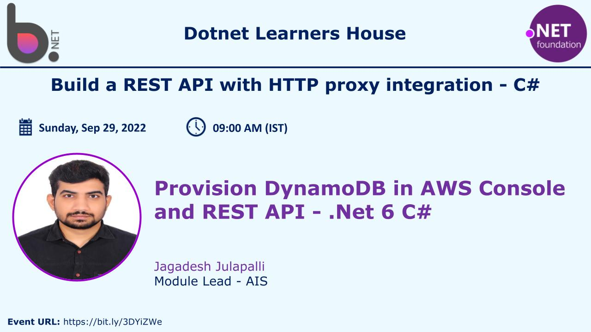
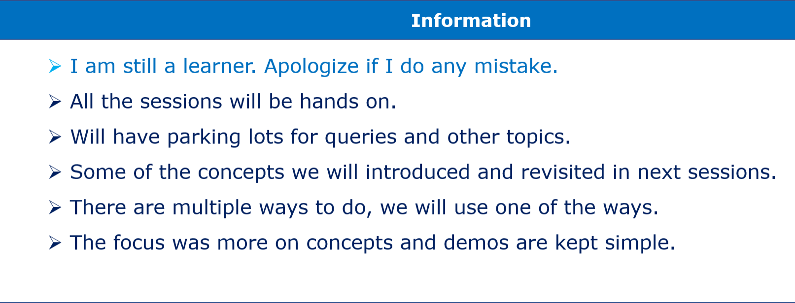
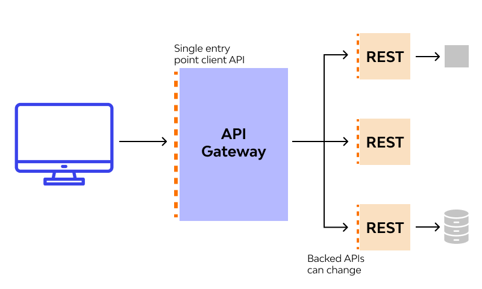

# Introduction to Amazon API Gateway and integration with REST API C# (.Net 6)

## Date Time: 15-Oct-2022 at 10:30 AM IST

## Event URL: [https://www.meetup.com/dot-net-learners-house-hyderabad/events/288853992/](https://www.meetup.com/dot-net-learners-house-hyderabad/events/288853992)

---
## Youtube URL: [https://youtu.be/jtFv--BcKfA](https://youtu.be/jtFv--BcKfA)

---

---

## Pre-Requisites

> 1. .NET 6
> 1. No SQL
> 1. BeanStalk

### Software/Tools

> 1. Visual Studio 2022

### Prior Knowledge

> 1. C#,
> 1. No SQL
> 1. AWS

### Assumptions

> 1. NIL

## Technology Stack

> 1. Elastic BeanStalk
> 1. Dynamo DB
> 1. API Gateway

## Information

## 

## What are we doing today?

> 1. What is Amazon API Gateway ?
> 1. Why do we need to use API Gateway?
> 1. Create API Gateway in AWS Console
> 1. Configure/Add Products API to API Gateway.

---

## 1. What is Amazon API Gateway ? (3 Minutes)
An API gateway is middleware that sits between an API endpoint and backend services, transmitting client requests to an appropriate service of an application.

## 

Amazon API Gateway is an AWS service for creating, publishing, maintaining, monitoring, and securing REST, HTTP, and WebSocket APIs at any scale. API developers can create APIs that access AWS or other web services, as well as data stored in the AWS Cloud. As an API Gateway API developer, you can create APIs for use in your own client applications. Or you can make your APIs available to third-party app developers.

## 

## 2. Why do we need to use API Gateway? (5 Minutes)

 * ### Simplifying Microservices Complexity
    * Consolidates rate limiting, token authorization, scaling up or down, and routing in a single mediation layer (the gateway).
    * Decouples the applications from the API management layer to provide a single interface for managing the microservices environment.
    * Allows organizations to manage endpoints centrally via APIs and an API management solution.
 * ### Improving Security
    * Stops SQL injections, DoS attacks, and malicious API and application activity through security policies managed at the gateway level.
    * The team can implement custom security settings for each API or application managed via the gateway. This allows teams to segment dangerous traffic or environments.
    * Rate limiting and session information can be managed and automated at the gateway level – minimizing risk and helping the team moderate external threats.

## 3. Create API Gateway in AWS Console (6 Minutes)
Demo.. time.. Lets do a deep dive.....!!
## 

## 4. Configure/Add Products API to API Gateway. (6 Minutes)

## 5. Deploy Stage and acess from Postman/API Gateway (3 Minutes)

## 6. Add Usage Plan and Acess Key and assign it to a stage (10 Minutes)

---

## SUMMARY / RECAP / Q&A

---

> 1. SUMMARY / RECAP / Q&A
> 2. Any open queries, I will get back through meetup chat/twitter.

---
