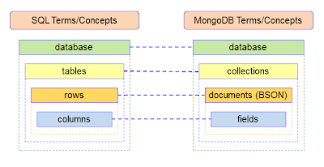

# Deploying .NET 6 Micro Service on AWS using Beanstalk

## Date Time: 12-Mar-2022 at 10:00 AM IST

## Event URL: [https://www.meetup.com/dot-net-learners-house-hyderabad/events/286232863/](https://www.meetup.com/dot-net-learners-house-hyderabad/events/286232863)

---

## Pre-Requisites

> 1. .NET 6
> 1. Mongo DB
> 1. BeanStalk

### Software/Tools

> 1. Visual Studio 2022

### Prior Knowledge

> 1. C#,
> 1. Document DB
> 1. AWS

### Assumptions

> 1. NIL

## Technology Stack

> 1. Elastic BeanStalk
> 1. Mongo DB Atlas

## Information

## 

## What are we doing today?

> 1. What are Beanstalk, and Mongo Db
> 1. Mongo Db in Mongo Atlas
> 1. NET 6 Web API
> 1. Executing it locally (IIS Express, Kestrel)
> 1. Deploying .NET 6 Web API using Beanstalk
> 1. Using Postman to access the API

---

## 1. What are Beanstalk, and Mongo Db (7 Minutes)

Elastic Beanstalk
---
## 

Picture courtesy https://image4.slideserve.com/8217987/features-of-aws-elastic-beanstalk-3-l.jpg
---

## Mongo DB

MongoDB is a source-available cross-platform document-oriented database program. Classified as a NoSQL database program, MongoDB uses JSON-like documents with optional schemas.

What and When

## 

## 

## 

## 2. Mongo Db in Mongo Atlas (2 Minutes)

MongoDB Atlas is a fully-managed cloud database that handles all the complexity of deploying, managing, and healing your deployments on the cloud service provider of your choice (AWS , Azure, and GCP). MongoDB Atlas is the best way to deploy, run, and scale MongoDB in the cloud.
https://www.mongodb.com/

## 3. NET 6 Web API (6 Minutes)
Demo.. time.. Lets do a deep dive.....!!
## 

## 4. Executing it locally (IIS Express, Kestrel) (4 Minutes)

## 5. Deploying .NET 6 Web API using Beanstalk (15 Minutes)

## 6. Using Postman to access the API (5 Minutes)

---

## SUMMARY / RECAP / Q&A

---

> 1. SUMMARY / RECAP / Q&A
> 2. Any open queries, I will get back through meetup chat/twitter.

---
