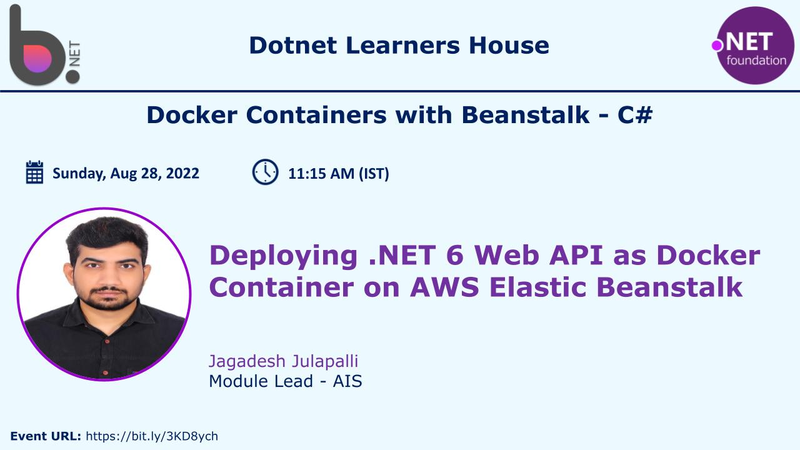

# Static Website in S3, AWS Lambda, Docker Containers with Beanstalk - C#

## Date Time: 28-Aug-2022 at 11:10 AM IST

## Event URL: [https://www.meetup.com/dot-net-learners-house-hyderabad/events/286822813/](https://www.meetup.com/dot-net-learners-house-hyderabad/events/286822813/)

---
## Youtube URL: [https://www.youtube.com/watch?v=Y2j0u6oQEMo&ab_channel=DotNetLearnersHouse](https://www.youtube.com/watch?v=Y2j0u6oQEMo&ab_channel=DotNetLearnersHouse)

---

---

## Pre-Requisites

> 1. .NET 6
> 1. Docker
> 1. BeanStalk

### Software/Tools

> 1. Visual Studio 2022
> 2. Docker Desktop
> 1. Python

### Prior Knowledge

> 1. C#,
> 1. Docker Commands
> 1. AWS

### Assumptions

> 1. NIL

## Technology Stack

> 1. Elastic BeanStalk
> 1. Docker
> 1. .Net 6

## Information

## 

## What are we doing today?

> 1. What is Docker and it's advantages
> 1. Create NET 6 Web API
> 1. Create Dockerfile and run on Docker desktop
> 1. Executing it locally on Docker desktop
> 1. Install EB CLI and run the image locally
> 1. Deploy Web API as Docker Container to AWS Elastic Beanstalk

---

## What is Docker and it's advantages (7 Minutes)

Elastic Beanstalk
---
## 

## 2. NET 6 Web API (6 Minutes)
Demo.. time.. Lets do a deep dive.....!!
## 

## 3. Create Dockerfile and build image (4 Minutes)

## 4. Executing it locally (Docker) (4 Minutes)

## 5. Install EB CLI and run locally (15 Minutes)

## Installation : [https://docs.aws.amazon.com/elasticbeanstalk/latest/dg/eb-cli3-install-advanced.html](https://docs.aws.amazon.com/elasticbeanstalk/latest/dg/eb-cli3-install-advanced.html)

## 6. Deploy the container to Beanstalk using EB CLI (15 Minutes)

---

## SUMMARY / RECAP / Q&A

---

> 1. SUMMARY / RECAP / Q&A
> 2. Any open queries, I will get back through meetup chat/twitter.

---
