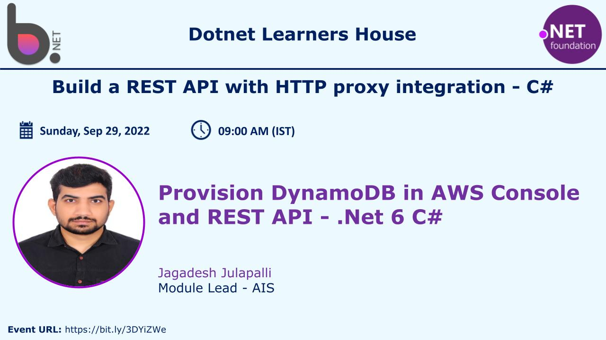

# Build a REST API with HTTP proxy integration

## Date Time: 29-Sep-2022 at 09:00 AM IST

## Event URL: [https://www.meetup.com/dot-net-learners-house-hyderabad/events/287732502/](https://www.meetup.com/dot-net-learners-house-hyderabad/events/287732502)

---
## Youtube URL: [https://www.youtube.com/watch?v=5rBhiI9e2B0](https://www.youtube.com/watch?v=5rBhiI9e2B0)

---

---

## Pre-Requisites

> 1. .NET 6
> 1. No SQL
> 1. BeanStalk

### Software/Tools

> 1. Visual Studio 2022

### Prior Knowledge

> 1. C#,
> 1. No SQL
> 1. AWS

### Assumptions

> 1. NIL

## Technology Stack

> 1. Elastic BeanStalk
> 1. Dynamo DB
> 1. API Gateway

## Information

## 

## What are we doing today?

> 1. What is Dynamo Db
> 1. Create DynamoDB in AWS Console
> 1. NET 6 Web API
> 1. Perform CURD operation on DynamoDB using .NET 6
> 1. Deploying .NET 6 Web API using Beanstalk
> 1. Integrate to Amazon API Gateway

---

## 1. What is Dynamo Db (7 Minutes)
Amazon DynamoDB is a fully managed proprietary NoSQL database service that supports key–value and document data structures and is offered by Amazon.com as part of the Amazon Web Services portfolio.

## 2. Create DynamoDB in AWS Console

## 3. NET 6 Web API (6 Minutes)
Demo.. time.. Lets do a deep dive.....!!
## 

## 4. Perform CURD operation on DynamoDB using .NET 6 (4 Minutes)

## 5. Deploying .NET 6 Web API using Beanstalk (15 Minutes)

## 6. Integrate to Amazon API Gateway

---

## SUMMARY / RECAP / Q&A

---

> 1. SUMMARY / RECAP / Q&A
> 2. Any open queries, I will get back through meetup chat/twitter.

---
