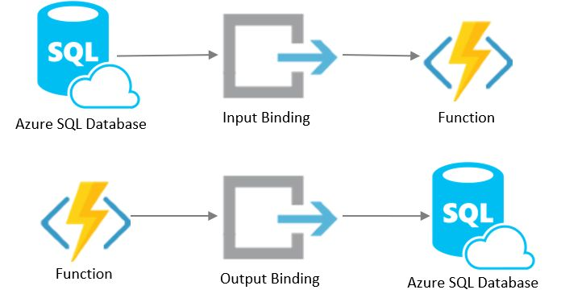

# Integrate Azure SQL and Azure Functions with SQL bindings

## Date Time: 10-Jul-2022 at 10:30 AM IST

## Event URL: [https://www.meetup.com/dot-net-learners-house-hyderabad/events/286027708/](https://www.meetup.com/dot-net-learners-house-hyderabad/events/286027708/)

---
## Youtube URL: [https://www.youtube.com/watch?v=LOr8iGd1i8s](https://www.youtube.com/watch?v=LOr8iGd1i8s)

---

---

## Pre-Requisites

> 1. .NET 6
> 1. Azure SQL
> 1. Azure Functions

### Software/Tools

> 1. Visual Studio 2022

### Prior Knowledge

> 1. C#,
> 1. MS SQL
> 1. Azure Functions

### Assumptions

> 1. NIL

## Technology Stack

> 1. Azure Functions
> 1. MS SQL

## Information

## 

## What are we doing today?

> 1. Understand Azure Functions and Serverless.
> 1. Azure Function bindings and their advantages.
> 1. Demo of Azure Function with SQL bindings.

---

## 1. Understand Azure Functions and Serverless (5 Minutes)

Azure Function is a serverless compute service that enables user to run event-triggered code without having to provision or manage infrastructure.

## 2. What are Bindings (5 Minutes)

Binding to a function is a way of declaratively connecting another resource to the function; bindings may be connected as input bindings, output bindings, or both. Data from bindings is provided to the function as parameters.

## 

### Considerations
> 1. Because the Azure SQL bindings doesn't have a trigger, you need to use another supported trigger to start a function that reads from or writes to an Azure SQL database.
> 1. Azure SQL binding supports version 2.x and later of the Functions runtime.
> 1. Source code for the Azure SQL bindings can be found in this <a href="https://github.com/Azure/azure-functions-sql-extension" target="_blank">GitHub repository</a>.
> 1. This binding requires connectivity to an Azure SQL or SQL Server database.
> 1. Output bindings against tables with columns of data types NTEXT, TEXT, or IMAGE aren't supported and data upserts will fail. These types <a href="https://docs.microsoft.com/en-us/sql/t-sql/data-types/ntext-text-and-image-transact-sql" target="_blank">will be removed</a> in a future version of SQL Server and aren't compatible with the OPENJSON function used by this Azure Functions binding.

## 3. Demo of Azure Function with SQL bindings. (30 Minutes)
Demo.. time.. Lets do a deep dive.....!!
## 

---

## SUMMARY / RECAP / Q&A

---

> 1. SUMMARY / RECAP / Q&A
> 2. Any open queries, I will get back through meetup chat/twitter.

---
